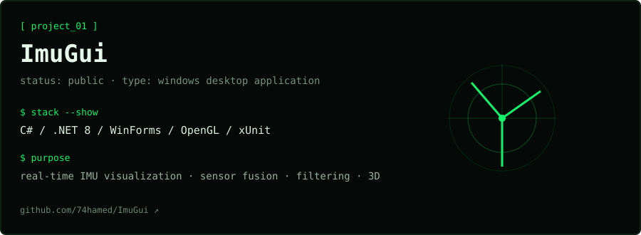
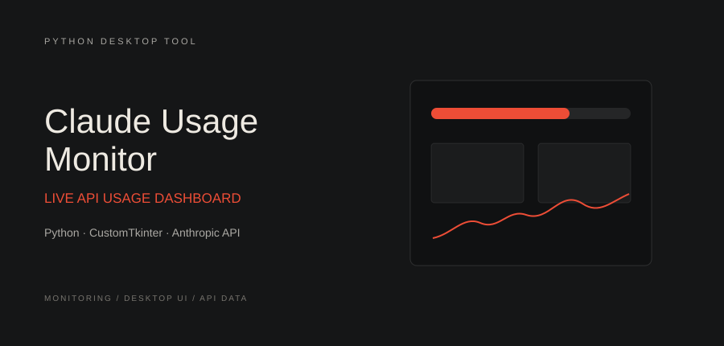
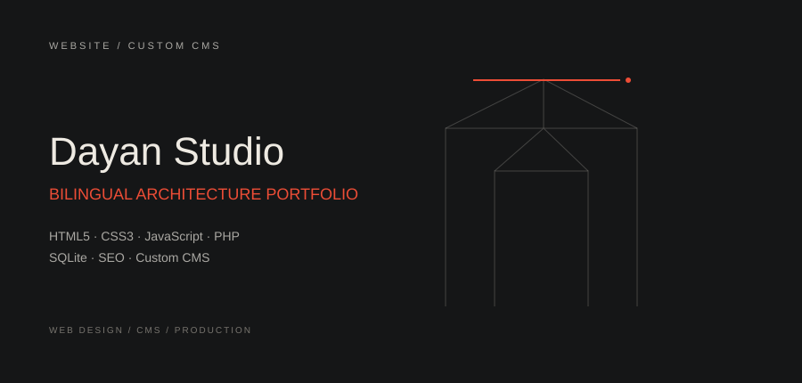
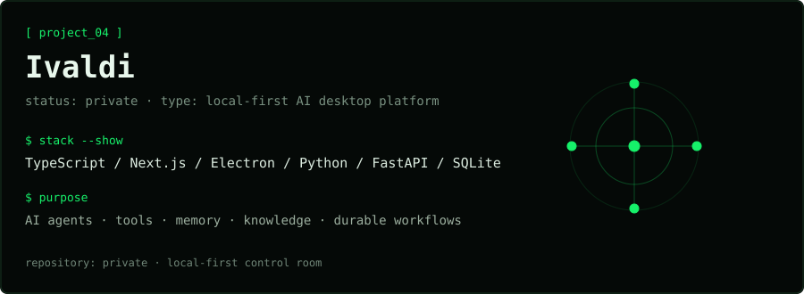
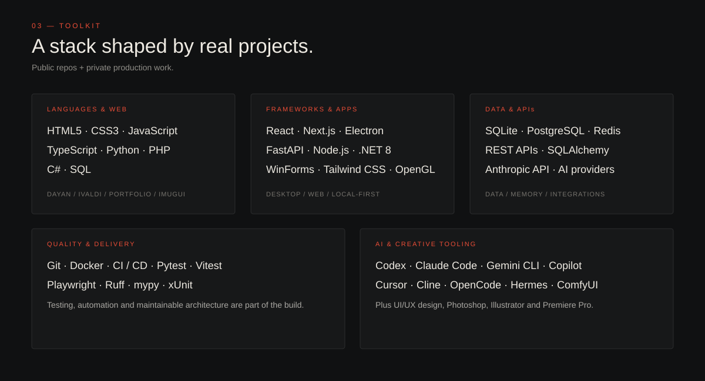
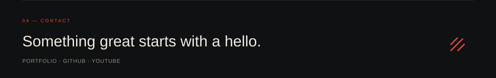

<div align="center">



<br/>

<a href="https://github.com/74hamed">
  
</a>
&nbsp;
<a href="https://www.youtube.com/@74Hamed">
  
</a>

</div>

---

### `./about`

```bash
$ whoami
74Hamed — Creative Developer

$ cat focus.txt
web dev
desktop apps
ui/ux & app design
ai-powered tools

$ cat approach.txt
smooth interactions
readable code
strong visual direction
interfaces that feel intentional
```

I build things end-to-end — from **production websites** and **desktop apps** to **AI tools** and real-time systems.  
Most of my work lives somewhere between **engineering and design**.

---

### `./projects`

<table>
<tr>
<td width="50%" valign="top">

<a href="https://github.com/74hamed/ImuGui">
  
</a>

</td>
<td width="50%" valign="top">

<a href="https://github.com/74hamed/claude-usage-monitor">
  
</a>

</td>
</tr>
<tr>
<td width="50%" valign="top">

<a href="https://dayanstudio.ir">
  
</a>

</td>
<td width="50%" valign="top">



</td>
</tr>
</table>

---

### `./skills`



<details>
<summary><b>cat full_stack.txt</b></summary>

<br/>

```txt
languages_web:
  HTML5 · CSS3 · JavaScript · TypeScript · Python · PHP · C# · SQL

frameworks_apps:
  React · Next.js · Electron · FastAPI · Node.js · .NET 8
  WinForms · Tailwind CSS · OpenGL

data_apis:
  SQLite · PostgreSQL · Redis · REST APIs · SQLAlchemy · Anthropic API

quality_delivery:
  Git · Docker · CI/CD · Playwright · Vitest · Pytest · Ruff · mypy · xUnit

design_media:
  UI/UX Design · App Design · Photoshop · Illustrator · Premiere Pro

ai_tooling:
  OpenAI Codex · Claude Code · Gemini CLI · GitHub Copilot
  Cursor · Cline · OpenCode · Kiro · Hermes · ComfyUI
```

</details>

---

### `./contact`



<div align="center">

<a href="https://74hamed.vercel.app/">
  
</a>

</div>
